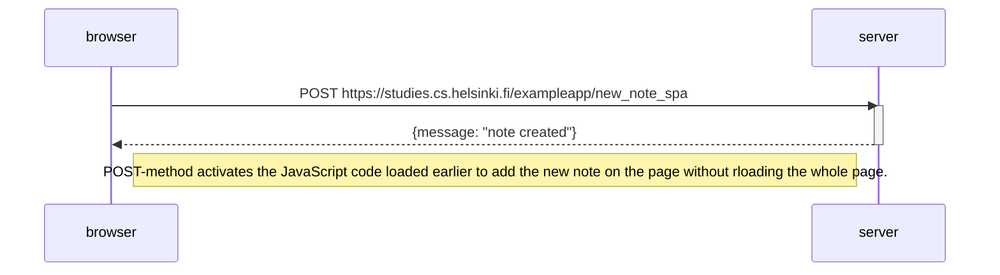

```mermaid
    sequenceDiagram
        participant browser
        participant server
        
        browser->>server: POST https://studies.cs.helsinki.fi/exampleapp/new_note_spa
        activate server
        server-->>browser: {message: "note created"}
        deactivate server

	Note right of browser: POST-method activates the JavaScript code loaded earlier to add the new note on the page without rloading the whole page.
```
